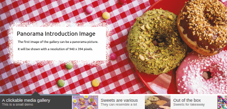
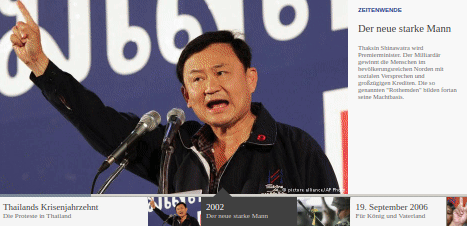
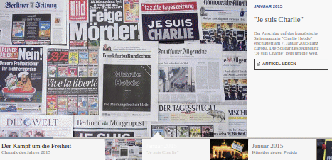
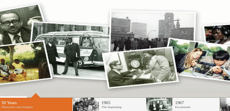
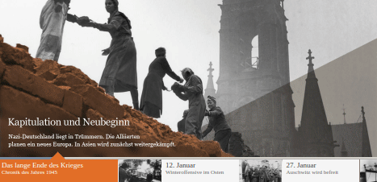

# Jquery Media Slideshow

Client-sided media slideshow plugin (carousel), supporting replaceable input files, multiple languages and a dynamic timeline for illustrating historical events. Originally developed for the purposes of [Deutsche Welle (DW), Bonn](https://www.dw.com/). Checkout the use cases presented in this document.

## Live demo

* [English version](http://www.nilsole.net/else/github/jquery_media_slideshow/?http://www.nilsole.net/else/github/jquery_media_slideshow/demo_cases/candy/candy.json&any)
* [German version](http://www.nilsole.net/else/github/jquery_media_slideshow/?http://www.nilsole.net/else/github/jquery_media_slideshow/demo_cases/candy/candy.json&de)

 
## Technologies used

* jQuery UI - v1.10.3 ([website](https://jqueryui.com/))
* jQuery SmoothDivScroll - v1.3 ([website](http://smoothdivscroll.com/))
* jquery.kinetic - v1.8.2 ([website](http://davetayls.github.io/jquery.kinetic/))
* jquery.mousewheel - v3.1.4 ([website](https://github.com/jquery/jquery-mousewheel))

## Further use cases

The plugin can be used for various purposes, including picture and video slideshows, landing pages for text articles, and many more.

|Description|Preview|Links|Embedded
| ------------------------- | ----------------------- | ------- | -------
|<strong>When we were 17: Youth at the crossroads.</strong> This project uses an advanced version of the slideshow plugin. Including videos, deep links to articles, and a scrollable element gallery.||[English version](http://www.dw.com/flashes/html5/mit17/index.html?http://www.dw.com/flashes/html5/mit17/content/data.json&en) [Russian version](http://www.dw.com/flashes/html5/mit17/index.html?http://www.dw.com/flashes/html5/mit17/content/data.json&ru)|[English version](http://www.dw.com/en/top-stories/when-we-were-17-youth-at-the-crossroads/s-101113) [Russian version](http://www.dw.com/ru/%D1%82%D0%B5%D0%BC%D1%8B-%D0%B4%D0%BD%D1%8F/%D0%B8%D1%81%D1%82%D0%BE%D1%80%D0%B8%D1%8F-%D0%B2-%D1%81%D1%83%D0%B4%D1%8C%D0%B1%D0%B0%D1%85/s-101114)
|<strong>Meine Oma, das Regime und ich.</strong> A total of six slideshows was created to tell audiences the lives of six grandmothers who had to deal with restrictive regimes. The project received a <a href="http://www.dw.com/de/dw-volont%C3%A4re-meine-oma-das-regime-und-ich-ausgezeichnet/a-18314695">CNN Journalism Award in the category "Online"</a> in 2015. The slideshows can be seen in the <a href="https://youtu.be/6UjG9tm3yl8?t=42s">jury's video statement</a>.|  |[Oma aus Kenia](http://www.dw.com/flashes/volo2014/timeline/?http://www.dw.com/flashes/volo2014/kenia/OmaKenia.json&de) [Oma aus Chile](http://www.dw.com/flashes/volo2014/timeline/?http://www.dw.com/flashes/volo2014/chile/OmaChile.json&de) [Oma aus Belarus](http://www.dw.com/flashes/volo2014/timeline/?http://www.dw.com/flashes/volo2014/belarus/OmaBelarus.json&de) [Oma aus Deutschland](http://www.dw.com/flashes/volo2014/timeline/?http://www.dw.com/flashes/volo2014/deutschland/OmaDeutschland.json&de) [Oma aus China](http://www.dw.com/flashes/volo2014/timeline/?http://www.dw.com/flashes/volo2014/china/OmaChina.json&de) [Oma aus Brasilien](http://www.dw.com/flashes/volo2014/timeline/?http://www.dw.com/flashes/volo2014/brasilien/OmaBrasilien.json&de)|[German version](http://www.dw.com/de/themen/meine-oma-das-regime-und-ich/s-101030)
|<strong>Thailands Krisenjahrzehnt.</strong> Short slideshow about a political crisis in Thailand.||[German version](http://www.dw.com/flashes/volo2014/timeline/?http://www.dw.com/flashes/timelinedaten/ThailandsKrisenjahrzehnt.json&de)|[German version](http://www.dw.com/de/thailands-krisenjahrzehnt/a-17651393)
|<strong>Der Kampf um die Freiheit.</strong> Slideshow about a terrorist attack in France.||[German version](http://www.dw.com/flashes/timeline/?http://www.dw.com/flashes/timelinedaten/2015_12_ArtofFreedom.json&de)|[German version](http://www.dw.com/de/der-kampf-um-die-freiheit/a-18947670)
|<strong>50 years of DW Akademie.</strong> A slideshow presenting the history of DW Akademie.||[English version](http://www.dw.com/flashes/html5/timelineakd/index.html?http://www.dw.com/flashes/html5/timelineakd/2015-04-17_akademie50_en.json&en) [German version]("http://www.dw.com/flashes/html5/timelineakd/index.html?http://www.dw.com/flashes/html5/timelineakd/2015-04-17_akademie50_de.json&de)|[English version](http://www.dw.com/en/dw-akademie/50-years/s-101426) [German version](http://www.dw.com/de/dw-akademie/50-jahre/s-101423)
|<strong>1945: Ende und Aufbruch.</strong> The slideshow tells the history of Germany after the Second World War and uses the capabilities of in-text links right next to the pictures.||[German version]("http://www.dw.com/flashes/timelinedaten/timeline_orange/?http://www.dw.com/flashes/timelinedaten/70Jahre2erWeltkrieg.json&de)|[German version](http://www.dw.com/de/themen/1945-ende-und-aufbruch/s-101458)

# Future plans

This project dates back to 2014/2015 and needs some improvements. Such as:

* Turn into a webpack
* Thereby: Restructure and clarify dependencies
* Consider using a CSS preprocessor 
* Simplify and improve codebase
* Make JSON data file generator available
* Add documentation / how-to guide
* Add further demo cases for demonstrating timeline capabilities 

